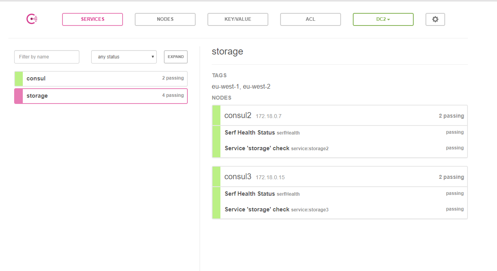
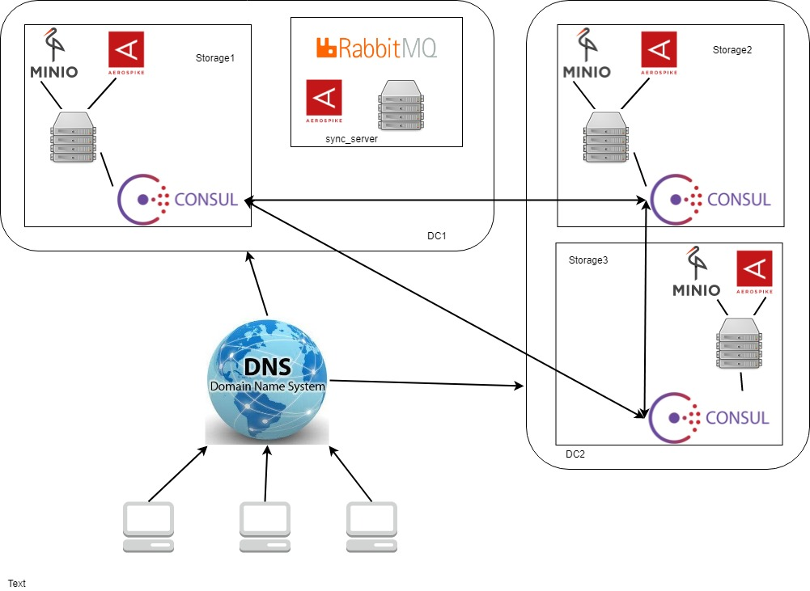

### Software needed

* install java 8 (at least 1.8.0_51)
http://www.oracle.com/technetwork/java/javase/downloads/jdk8-downloads-2133151.html
* install sbt 1.1.4
https://www.scala-sbt.org/download.html
* latest docker  (tested on 18.03.1-ce)
https://docs.docker.com/install/
https://docs.docker.com/install/linux/docker-ce/ubuntu/

### Build docker images
From the directory where the project is located.
Next command creates two docker images `devchallenge/storage` and `devchallenge/sync` 
```
sbt docker
```

### Run sample

* from root of project `cd docker`
* run `docker-compose up`  
* please wait for some time for service discovery to set up cluster.
Check `http://localhost:8501/ui/#/dc2/services/storage`
There should be 4 passes in DC2 in storage app and 2 passes in DC1 in storage app.
Console should show constant consul info 
```
consul2_1             |     2018/05/13 20:04:47 [INFO] agent: Synced service "storage2"
consul1_1             |     2018/05/13 20:04:47 [INFO] agent: Synced service "storage1"
consul3_1             |     2018/05/13 20:04:49 [INFO] agent: Synced service "storage3"
```



### Sample upload and download

1) Generated file id

* upload file with curl 

```
curl -F "fileData=@Readme.md" -X POST http://localhost:8080/upload
```
* response will contain generated file name and version
```
{
"fileId":"2e3bb21a-84e6-4be3-95d1-e713f91db5c6",
"version":"0e9d6b38-72d1-4c34-89ad-a9ca97ff3434"
}
```
* download with curl by file id
```
curl -s -o /dev/null -D -  http://localhost:8080/download/2e3bb21a-84e6-4be3-95d1-e713f91db5c6
```
* response contains header showing the version downloaded.
```
Content-Disposition: attachment; filename="build.sbt"
version: 0e9d6b38-72d1-4c34-89ad-a9ca97ff3434
```
* download can be done explicitly with version. First path param is file, second is version.
```
curl -s -o /dev/null -D -  http://localhost:8080/download/2e3bb21a-84e6-4be3-95d1-e713f91db5c6/0e9d6b38-72d1-4c34-89ad-a9ca97ff3434
```

2) Via browser. Visit `http://localhost:8080`. Page contains upload form. it is added for demo purposes.

3) Run tests by `sbt cucumber`. There are human-readable scenarios in `e2e/src/test/resources`

The uploaded chunks can be observed in minio browser:
```
http://localhost:9000/minio/storage/
login: minio
password: minio123
```

### `docker-compose` whats inside

File represents two sample datacenters. DC1 with one storage app, DC2 with two storage apps. 
There is also app that syncs  data, handling messages from rabbit.



1) Storage app consists of:
- storage application `devchallenge`. Represents basic functionality for upload/download. can be found in  "storage" folder of this repo  
- file metadata storage `aerospike`. Stores data about replica locations and file metadata.
Chosen as a highly available storage. Could be replicated via master-master.
Even if one node is down some metadata is available, so files (at least old versions) are downloadable. 
- blob storage `minio`. 
While not having replication between servers, provides really efficient holding of multiple ssd and hdd disks.
Compatible with S3 api. 

2) Sync app consists of:
- sync server. `devchallenge/sync`. Could be found in `sync` directory.
Runs job that handles messages about new files uploaded and performes synchronization.
Exposes http endpoint for getting info about where the replicas are located
- file metadata storage `aerospike`. Stores data about replica locations and file metadata 
- `rabbitmq`. Represents job queue.
Most likely should be changed to replicated kafka with partitioning by file id to keep global upload ordering.

### General file upload logic
* only first multipart file is used
* as files could be big (exceeding RAM) the stream is split into chunks of 5MB.
Metadata knows the number of chunks and download is performed by concatenating streams from each chunk

### Versioning  

* each file has version
* when uploading new file via POST, a new version is generated. Old versions are accessible as well. 
By default last version is returned if no version explicitly specified when performing download  
```
curl -F "fileData=@Readme.md" -X POST http://localhost:8080/upload
```
* when uploading new file via PUT, a file id or a file id with version could be specified. PUT overrides previous versions if existed before.
```
curl -F "fileData=@Readme.md" -X PUT http://localhost:8080/upload/fileId/version1
curl -F "fileData=@Readme.md" -X PUT http://localhost:8080/upload/fileId
```

### Authentication
It is absent in current implementation. Would be done as follows:
* `Authentication` header is passed with JWT signed with a key.
* this approach is chosen because there is internal endpoint. 
To distinguish internal authorization from user auth, it is sufficient to have multiple sign keys     
* JWTs can be generated in advance for testing

### Replication
* `REPLICATION_FACTOR` default value is `1` which means that there will be one replica along with original host. So there will be two hosts with file.
* upon upload storage sends notification that file could be replicated
* sync handles this message by finding any other server without the file uploaded.
* potential replicas are found via service discovery
* additional app `sync` was created to separate synchronization logic from download/upload
and potentially give higher scalability via leveraging work queueing.
* special `/internal/upload/fileId/version` endpoint is created to upload file without notification.
Should be hidden from users or have separate auth.  
* replication is eventually consistent
Can be checked by using one of hosts from `docker-compose.yml`:
```
http://localhost:8080
http://localhost:8081
http://localhost:8082
```
Corresponding minio instances:
```
http://localhost:9000/minio/storage/
http://localhost:9001/minio/storage/
http://localhost:9002/minio/storage/
```

### Fallback 
* checks if there is file locally
* if no then asks sync app about replica locations of the file
* proxies file stream from replica. 
Proxying gives opportunity to cache the entity locally so that it is not downloaded next time (it is potential improvement)
  
See `DownloadWithFallbackService`

### Nearest server to download
Consul's [Network coordinates](https://www.consul.io/docs/internals/coordinates.html) are used. Consul estimates roundtrip and gives nearest nodes
My simple implementation is:
* [list datacenters](https://www.consul.io/api/catalog.html#list-datacenters). 
DCs are sorted in ascending order based on the estimated median round trip time from the server to the servers in that datacenter.
* [list closest service instances](https://www.consul.io/api/catalog.html#list-nodes-for-service) in each DC. The distance is estimated to the consul in current DC.

### Acknowledge of free space on other services, choice of the server with the freest space
Not implemented. 
The total file size is calculated and all syncs are performed by special app.
So it seems a good place to check availability and call special `/reserve/fileId` method with `{size;123}`
While we have special internal endpoint `/internal/upload` it can check if the upload was reserved.
Current free space can be stored in consul key-value to prevent additional network calls to storage from sync app.  

     
### Mechanism of possible choices of the same server for downloading as uploading for the same customer
Not implemented.
Use sticky sessions.
It is possible to use current setup of consul to check for available hosts and proxy requests.
For example, traefik can do [sticky sessions](https://docs.traefik.io/basics/#sticky-sessions) as well as [use consul as back end](https://docs.traefik.io/configuration/backends/consulcatalog/)

### Testing
* Really like scenario approach. See `Download.feature` for sample ones. Represend end-to-end tests. 
This scenarios can be used in CI process and likewise the docker-compose file provided.
* Unit tests are not implemented due to lack of time but should be really useful. 
* It is likely to have module tests as well. For example, only storage, without replication. 

