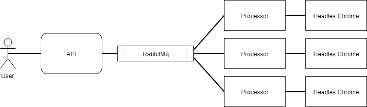
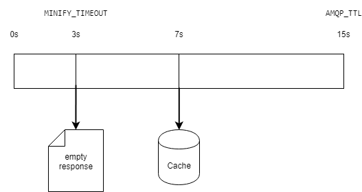
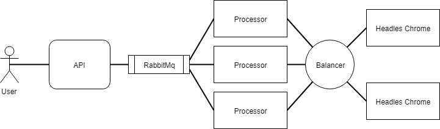

### Software requirements

* install java 8 (at least 1.8.0_51)
http://www.oracle.com/technetwork/java/javase/downloads/jdk8-downloads-2133151.html
* docker  (tested on 18.03.1-ce, docker-compose 1.8.0)
https://docs.docker.com/install/
https://docs.docker.com/install/linux/docker-ce/ubuntu/
* unless provided `xsbt` does not work (not official), please install sbt
https://www.scala-sbt.org/download.html

### General architecture

1) There is an API server. It receives user requests for minification and sends them to processors in parallel.
RPC via RabbitMQ is used for communication. 
2) Processor. Each processor handles at most 1 message at a time.
This behaviour gives opportunity to equally split load and process request in parallel.
Each processor has its own Chrome which helps to control pages open and close them after processing (it would likely be pod in k8s)
Chrome does not stop and processor connects to the same instance on each request. If Chrome instance is reloaded after crash, processor will connect to a new one.
  


### Build docker images
All further commands should be executed from the root of the project.
If `./xsbt` does not work, please change it to `sbt` in all further examples (e.g. `sbt docker`)
```
 ./xsbt.sh docker
```

### Run sample

* To start sample setup with 1 API and 1 processor.  
```
docker-compose -f docker/docker-compose.yml up
```
As a result the following images should be built:
1) devchallenge/api - API server that exposes HTTP endpoints
2) devchallenge/processor - handles requests and does minification
3) devchallenge/static - sample nginx with static pages. Can be found in e2e/nginx

* Minify `http://nginx:8081/page1/`. Page1 - simple page that should be returned in 3 seconds that is the timeout of request (see more in Caching).
If the request processes longer for some reason, please retry after 15 seconds to use cached response.
```
curl -X POST -H "Content-Type: application/json" -d "{\"urls\":[\"http://nginx:8081/page1/\"]}"  http://localhost:8080/minify
```
Response expected:
```
{"http://nginx:8081/page1/":".red{color:red}"}
```

* Minify `http://nginx:8081/page2/`. Page2 - page that takes more time to process than response timeout.
Only cached version is possible.
```
curl -X POST -H "Content-Type: application/json" -d "{\"urls\":[\"http://nginx:8081/page2/\"]}"  http://localhost:8080/minify
```
First only empty response is returned:
```
{}
```
Processing is continued in background and you can get cached version.
```
curl -X POST -H "Content-Type: application/json" -d "{\"urls\":[\"http://nginx:8081/page2/\"]}"  http://localhost:8080/minify
```
Result:
```
{"http://nginx:8081/page2/":".black{color:#000}"}
```
* It is also possible to request multiple urls.
```
curl -X POST -H "Content-Type: application/json" -d "{\"urls\":[\"http://nginx:8081/page2/\",\"http://nginx:8081/page1/\",\"http://nginx:8081/redirect1\"]}"  http://localhost:8080/minify
``` 

Response:
```
{"http://nginx:8081/page2/":".black{color:#000}","http://nginx:8081/page1/":".red{color:red}"}
```
Be careful(!!!): cache ttl is set to 100 ms and there is only one processor. 
At first response will be empty, only if page1 is processed. But this is unpredictable because processing is done in parallel and order changes each time.
 
### Tests
There are 3 types of tests:
* unit tests, located in api/src/test directory 
* integration tests for custom wrapper aerospike, that I use as cache. 
* end-to-end tests that run scenarios against all components of the system.

Both integration and e2e tests use docker and [testcontainers](https://github.com/testcontainers/testcontainers-java)
library to start containers before tests. Testcontainers require Docker version > 1.6.0.
Please check if docker daemon is exposed on `tcp://localhost:2375`.
If you use windows, please check that drive where docker installed is shared.   

Running tests:
* please stop any docker containers from previous section if any are running:
```
docker-compose -f docker/docker-compose.yml down
```
or even:
```
docker stop $(docker ps -aq)
docker rm $(docker ps -aq)
```
* run unit tests:
```
./xsbt.sh test
```
* run integration and e2e tests:
```
./xsbt.sh it:test
```
 
### Minification

For minification [minimalcss](https://github.com/peterbe/minimalcss) which uses
[puppeteer](https://github.com/GoogleChrome/puppeteer) nodejs api for headless chrome.
I use custom browser so that it does not created each time.
Only css from links is used for minification and usefulness of [inline css](https://github.com/peterbe/minimalcss/issues/114)
is argued.

### Caching 

* aerospike is used for caching. Powerful solution that can be configured to be either eventually consistent or strongly consistent
with build-in replication
* each url is checked against cache before processing
* processing starts only if no cache entry is found
* processing time is configured via `AMQP_TTL` env property. Sample setup value is 15s.
* taking into account that web applications require fast response time from server,
timeout for request is introduced: `MINIFY_TIMEOUT` = 3s.
If the processing does not end before MINIFY_TIMEOUT then empty response is returned for that url.
Processing continues in background and the result will be cached if it finishes before `AMQP_TTL`



### Error handling
* API always try to respond, at least with empty response.
* pages that does not exist are processed each time. Response is empty for them. Not cached.
* redirect pages are cached. Response is empty for them.
* timeouts are not cached. Response is empty for them.

Server failures:
* processor sets up connection to chrome on each request - will connect to a new one after chrome restart
* processor and API reconnect to rabbitmq if it restarts

### Memory leak
To prevent a memory leak while opening headless chromes there were several precaution were taken:
* chromes are located in isolated environment - docker
* chromes are not started each time - processor reestablishes connection, 
chromes continues to run after the processor's request ends 
* processor closes all its pages in the end of processing each url
* each processor has its own chrome running to lower the amount of pages open 

### Performance testing
* only assumptions about relative performance can be made in local environment
* processing time highly relies on the page processed

There was a `MinifySimulation` created to assess potential scaling of the system:
* it requests to minify page1. Page 1 processing takes about 1.5-2.5s when only one request is handled
* 10 requests per second are perfromed during 10 seconds. 100 requests in total
* the response should contain css for page 1, not just empty response

1) 1 API, 1 Processor, no caching  
* Run docker compose and wait until rabbitmq is started. 'Server startup complete;' in rabbitmq_1 and 'Listener started' in processor_1.
```
docker-compose -f docker/load_test/compose_1_processor.yml up
```

* Run scenario:
```
./xsbt.sh "project gatling" run
```

* Results:
1) only 2 of 100 requests are successful. 
This means that requests are processed one by one, because there is only one processor.
2) Mean response time is about 3s - most requests were waiting until timeout  

================================================================================
---- Global Information --------------------------------------------------------
> request count                                        100 (OK=2      KO=98    )
> min response time                                   1130 (OK=1130   KO=3018  )
> max response time                                   3032 (OK=2158   KO=3032  )
> mean response time                                  2995 (OK=1644   KO=3023  )
> std deviation                                        206 (OK=514    KO=2     )
> response time 50th percentile                       3023 (OK=1644   KO=3023  )
> response time 75th percentile                       3024 (OK=1901   KO=3024  )
> response time 95th percentile                       3025 (OK=2107   KO=3025  )
> response time 99th percentile                       3031 (OK=2148   KO=3031  )
> mean requests/sec                                   6.25 (OK=0.125  KO=6.125 )
---- Response Time Distribution ------------------------------------------------
> t < 800 ms                                             0 (  0%)
> 800 ms < t < 1200 ms                                   1 (  1%)
> t > 1200 ms                                            1 (  1%)
> failed                                                98 ( 98%)
---- Errors --------------------------------------------------------------------
> substring(http://nginx:8081/page1/).find.exists, found nothing     98 (100,0%)
================================================================================

* stop the docker:
```
docker-compose -f docker/load_test/compose_1_processor.yml down
```


2) 1 API, 5 Processors, no caching
* Run docker compose and wait until rabbitmq is started. 'Server startup complete;' in rabbitmq_1 and 'Listener started' in processor_1. 
```
docker-compose -f docker/load_test/compose_5_processors.yml up
```

* Run scenario:
```
./xsbt.sh "project gatling" run
```

* Results:
1) 14 of 100 requests are successful. That is more than 5 times as much as with one processor.
This means that adding processors can scale load (this behaviour is expected).
2) Mean response time is still about 3s - most requests were waiting until timeout  

================================================================================
---- Global Information --------------------------------------------------------
> request count                                        100 (OK=14     KO=86    )
> min response time                                   1297 (OK=1297   KO=3021  )
> max response time                                   3047 (OK=3016   KO=3047  )
> mean response time                                  2896 (OK=2085   KO=3028  )
> std deviation                                        398 (OK=606    KO=5     )
> response time 50th percentile                       3026 (OK=2168   KO=3027  )
> response time 75th percentile                       3029 (OK=2526   KO=3032  )
> response time 95th percentile                       3037 (OK=2972   KO=3038  )
> response time 99th percentile                       3040 (OK=3007   KO=3041  )
> mean requests/sec                                   6.25 (OK=0.875  KO=5.375 )
---- Response Time Distribution ------------------------------------------------
> t < 800 ms                                             0 (  0%)
> 800 ms < t < 1200 ms                                   0 (  0%)
> t > 1200 ms                                           14 ( 14%)
> failed                                                86 ( 86%)
---- Errors --------------------------------------------------------------------
> substring(http://nginx:8081/page1/).find.exists, found nothing     86 (100,0%)
================================================================================

* stop the docker:
```
docker-compose -f docker/load_test/compose_5_processors.yml down
```

3) 1 API, 1 Processor, Caching is ON
* Run docker compose and wait until rabbitmq is started. 'Server startup complete;' in rabbitmq_1 and 'Listener started' in processor_1. 
```
docker-compose -f docker/load_test/compose_1_processor_with_cache.yml up
```

* Run scenario:
```
./xsbt.sh "project gatling" run
```

* Results:
1) 82 of 100 requests are successful.
The load is static with 10 requests per second. 
This means that it took 2s to put processed value to cache.
18 requests from firs seconds timed out because they were enqueued to process before the cache was populated.
2) Mean response time is about 600ms - most of the responses use cache.  


================================================================================
---- Global Information --------------------------------------------------------
> request count                                        100 (OK=82     KO=18    )
> min response time                                      7 (OK=7      KO=3025  )
> max response time                                   3511 (OK=2891   KO=3511  )
> mean response time                                   612 (OK=71     KO=3075  )
> std deviation                                       1205 (OK=379    KO=118   )
> response time 50th percentile                         11 (OK=10     KO=3035  )
> response time 75th percentile                         19 (OK=12     KO=3041  )
> response time 95th percentile                       3039 (OK=35     KO=3297  )
> response time 99th percentile                       3262 (OK=2136   KO=3468  )
> mean requests/sec                                  7.692 (OK=6.308  KO=1.385 )
---- Response Time Distribution ------------------------------------------------
> t < 800 ms                                            80 ( 80%)
> 800 ms < t < 1200 ms                                   0 (  0%)
> t > 1200 ms                                            2 (  2%)
> failed                                                18 ( 18%)
---- Errors --------------------------------------------------------------------
> substring(http://nginx:8081/page1/).find.exists, found nothing     18 (100,0%)
================================================================================

* stop the docker:
```
docker-compose -f docker/load_test/compose_1_processor_with_cache.yml down
```


### Additional thoughts

Current implementation enables to have another deployment architecture.
It is possible to use a pool of chromes and load balance processor requests to different ones each time.
This way there could be more processors that chromes to utilize resources.
The approach was not tested and can potentially introduce more instabilities in processing.
However it is likely to be cheaper in deployment costs as the chrome instances will utilize more resources
and will not be idle.


